# G1 vs G2 — IFS-FESOM Storyline Comparison

**IFS-FESOM km-scale storyline simulations · Three climate states · Initialization update assessment**

---

## What Changed: G1 → G2

Two key changes between generations:

1. **Model update** — G2 uses a bugfixed model version with a new runoff scheme.
2. **Initialization** — G2 branches all three experiments from the EERIE coupled framework, removing the mixed-IC inconsistency of G1.

---

## Experiment Configurations

| Experiment | Climate state | Forcing | G1 Initialization | G2 Initialization |
|------------|--------------|---------|-------------------|-------------------|
| **Cont** | ~1950, cooler | CMIP6-hist 1950 (fixed) | ERA5 atm + standalone FESOM ocean (1945–1949) | EERIE control branch (1950) ✅ |
| **Hist** | Present-day | CMIP6-SSP3-7.0, transient 2017–2024 | ERA5 atm + standalone FESOM ocean (2012–2016) | EERIE historical branch (2017) ✅ |
| **Tp2K** | +2 K warmer | CMIP6-SSP3-7.0, 2050 (fixed) | NextGEMS branch (2040) | EERIE projection branch (2050) ✅ |

> **G1 inconsistency:** Cont and Hist used ERA5 atmosphere + standalone FESOM ocean spinup, while Tp2K used a fully coupled NextGEMS branch from a different coupled system. G2 resolves this — all three experiments branch from the same EERIE coupled framework.

### G2 Global Mean Temperature — Per Member

G2 runs **5 ensemble members for the complete simulation period** (G1 only had 5 members for the final part of 2024).

| Member | Cont (K) | Hist (K) | Tp2K (K) | Hist − Cont (K) | Tp2K − Hist (K) | Tp2K − Cont (K) |
|--------|---------|---------|---------|----------------|----------------|----------------|
| E1     | 286.7   | 287.5   | 288.9   | 0.9            | 1.3            | 2.2            |
| E2     | 286.7   | 287.6   | 288.9   | 0.9            | 1.3            | 2.2            |
| E3     | 286.7   | 287.5   | 288.9   | 0.9            | 1.4            | 2.2            |
| E4     | 286.7   | 287.5   | 288.9   | 0.9            | 1.4            | 2.2            |
| E5     | 286.7   | 287.6   | 288.9   | 0.9            | 1.3            | 2.2            |
| **ENS MEAN** | **286.7** | **287.5** | **288.9** | **0.9** | **1.3** | **2.2** |

### G1 vs G2 ΔT Comparison

> ⚠️ The Cont→Hist warming signal is **smaller in G2 (+0.9 K) than in G1 (+1.3 K)**, likely reflecting the improved EERIE ocean initialization providing a more physically consistent 1950 climate state. The Cont→Tp2K signal is similar (G2: +2.2 K vs G1: +2.3 K).

| Pair | G1 ΔT | G2 ΔT (ENS MEAN) | Difference |
|------|-------|-----------------|----------|
| Cont → Hist | ≈ +1.3 K | **+0.9 K** | −0.4 K |
| Hist → Tp2K | ≈ +1.0 K | **+1.3 K** | +0.3 K |
| Cont → Tp2K | ≈ +2.3 K | **+2.2 K** | −0.1 K |

---

## 1. Large-scale Climate State

### G1 vs G2 vs ERA5 — Hist Daily T2M (2017–2024)

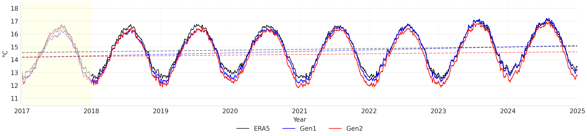

**Caption:** Daily global mean 2m temperature for the Hist experiment: ERA5 (black), Gen1 (blue), Gen2 (red), 2017–2024. Dashed lines = period time-means. Yellow shading = spinup period (Jan–Apr 2017).

**Analysis:**

- ✅ **Phase:** Both G1 and G2 reproduce the seasonal cycle timing accurately throughout the full 2017–2024 period. The annual cycle phase is tightly locked to ERA5, as expected from spectral nudging constraining the large-scale circulation.
- ⚠️ **G1 warm bias:** G1 (blue) runs *systematically warmer* than ERA5 throughout. The time-mean dashed lines show G1 sitting ~0.4–0.5 K above ERA5, most pronounced in summer peaks where G1 clearly overshoots ERA5.
- ⬇️ **G2 improvement:** G2 (red) is *noticeably cooler than G1*, with the time-mean (pink dashed) sitting between G1 and ERA5. The bias reduction is most visible in summer maxima and winter minima. A small residual warm bias (~0.1–0.2 K) remains in G2 relative to ERA5.
- 📋 **Spinup (2017, yellow):** Both generations show some transient adjustment in the first few months (dotted region). G2 settles more quickly, consistent with the better-initialised EERIE ocean state.

> The improvement from G1 to G2 is primarily attributable to the EERIE-based ocean initialization providing a better-spun-up SST field for the Hist climate state, combined with the model bugfix and new runoff scheme.

---

### All Experiments — Daily T2M (2017–2024)

> ℹ️ **Note on data gaps:** G2 Cont starts from 2018 (2017 retrieval pending); Tp2K has a short gap around mid-2022. Both are plotting artefacts only — the model data exists.

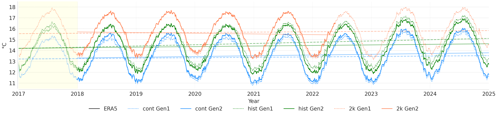

**Caption:** Daily global mean 2m temperature: ERA5 (black), Cont G1 (blue dotted) / G2 (blue solid), Hist G1 (green dotted) / G2 (green solid), Tp2K G1 (orange dotted) / G2 (orange solid). Dashed horizontals = time-period means per experiment.

**Analysis:**
- 🌡 **Climate state separation:** Three stable, well-separated bands across all 8 years — Cont (~13 °C), Hist (~14.2 °C), Tp2K (~15.7 °C) — confirm the experiments reproduce their intended background climates.
- ✏️ **G1 vs G2 per experiment:** Cont shows the largest inter-generation difference (G2 noticeably cooler, from improved EERIE 1950 IC). Hist and Tp2K track very closely between G1 and G2.
- ✅ **Seasonal cycle phase:** All six model runs faithfully lock to ERA5's seasonal timing. No phase drift across 8 years.
- 📊 **Dashed time-means:** Cont→Hist gap (~1.2 °C) and Hist→Tp2K gap (~1.5 °C) are consistent with the global mean ΔT values of +0.9 K and +1.3 K.

---

### Zonal Mean T2M — G1 vs G2 (Hist)

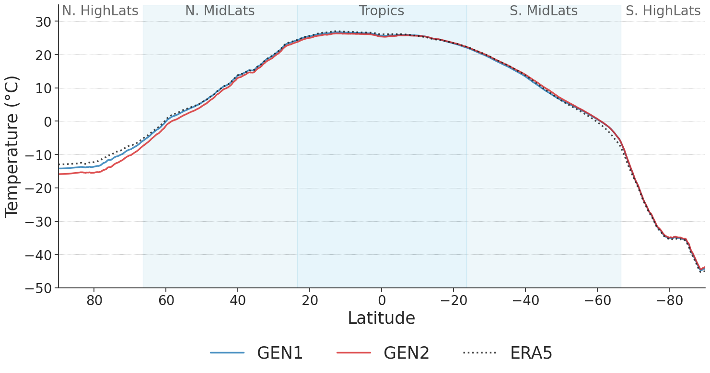

**Caption:** Time-mean zonal mean 2m temperature for the Hist experiment — Gen1 (blue), Gen2 (red), ERA5 (black).

**Analysis:**
- 🌍 **Tropics & N. mid-lats (60°S–60°N):** G1 and G2 are nearly indistinguishable from each other and from ERA5. Nudging effectively constrains large-scale circulation in these regions regardless of IC generation.
- ⚠️ **N. High Lats (60°N–90°N):** G1 has a pronounced warm bias (~3–5°C above ERA5) in the Arctic. G2 corrects this substantially, pulling the zonal mean much closer to ERA5. This is the **most striking inter-generation improvement**, likely from the better-spun-up EERIE Arctic and sub-polar ocean.
- ⚠️ **S. High Lats (60°S–90°S):** Both G1 and G2 are warmer than ERA5 in the Southern Ocean, but G2 is slightly closer. The residual SH bias is a known limitation from Antarctic sea-ice and deep-ocean spin-up and will reduce with longer coupled spinups.
- ✅ **Overall:** The G2 improvement is latitude-dependent — most pronounced at the poles where ocean state matters most, negligible in the tropics where atmospheric nudging dominates.

---

### Zonal Mean T2M — All Experiments

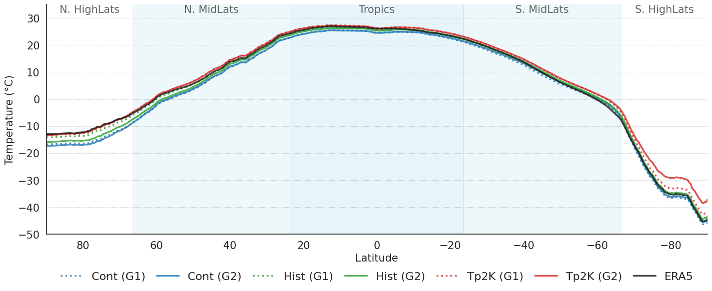

**Caption:** Time-mean zonal mean 2m temperature for all experiments — Cont G1 (blue dotted) / G2 (blue solid), Hist G1 (green dotted) / G2 (green solid), Tp2K G1 (red dotted) / G2 (red solid), ERA5 (black).

**Analysis:**
- 🌡 **Experiment separation:** The three climate states are cleanly separated at all latitudes. In the N. high lats: Cont is ~5–6°C colder than Hist, and Hist ~2–3°C colder than Tp2K. Separation narrows in the tropics and widens again in the Southern high latitudes.
- 🌐 **Tropics — all near ERA5:** All six model runs sit close to ERA5 in the tropical belt (~30°S–30°N). Spectral nudging is most effective here, homogenising temperature responses across experiments.
- ⚠️ **S. High Lats — Tp2K divergence:** Tp2K (red) shows the largest departure from ERA5 poleward of 70°S, running significantly warmer. This reflects the EERIE 2050 ocean state carrying a warmer Southern Ocean and reduced Antarctic sea-ice extent.
- ✏️ **G1 vs G2 by experiment:** Within Cont (blue), G2 (solid) runs notably cooler at mid-to-high NH latitudes. Hist and Tp2K show very small G1/G2 differences, confirming the EERIE IC improvement mostly impacts the Cont high-latitude mean state.

### Regional Time Series

Time series of key variables by region for all experiments and both generations.

| Figure | Caption |
|--------|---------|
| 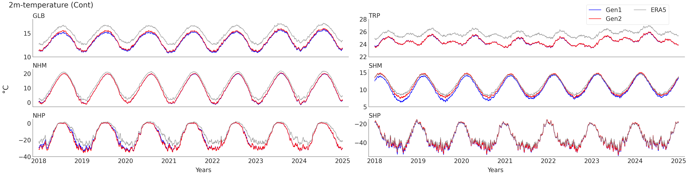 | **Regional T2M — Cont experiment.** |
| 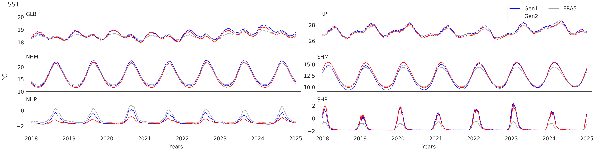 | **Regional SST time series.** Key diagnostic for ocean initialization impact. |
| 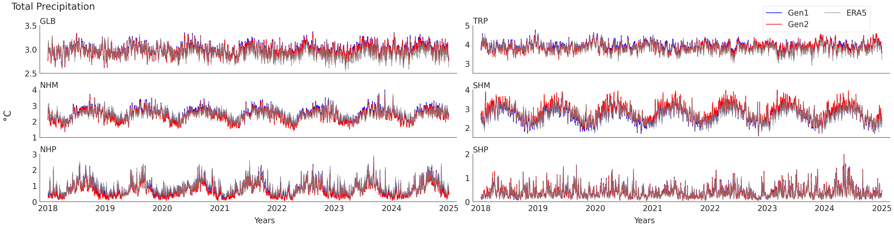 | **Regional precipitation time series** — all experiments. |
| 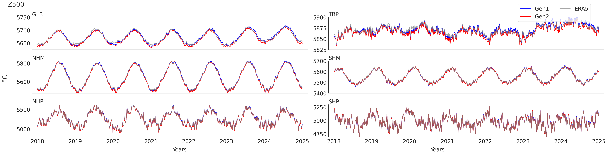 | **Regional Z500 time series.** |

---

## 2. Model Bias & Evaluation vs ERA5

### 2m Temperature and SST

| Figure | Caption |
|--------|---------|
| 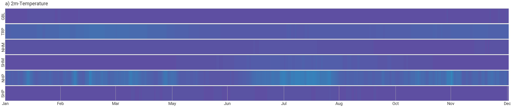 | **Core T2M bias maps (G2).** |
|  | **Seasonal T2M & SST bias — DJF/MAM/JJA/SON.** |
|  | **Annual mean T2M & SST bias vs ERA5.** |

### Precipitation

| Figure | Caption |
|--------|---------|
| 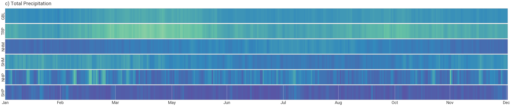 | **Core precipitation bias maps (G2).** |
| 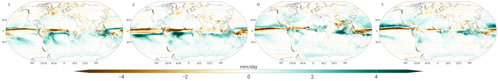 | **Seasonal precipitation bias.** |

### Z500 Geopotential Height

| Figure | Caption |
|--------|---------|
| 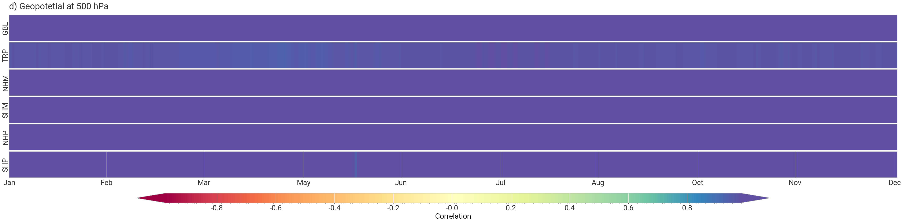 | **Core Z500 bias (G2).** |
| 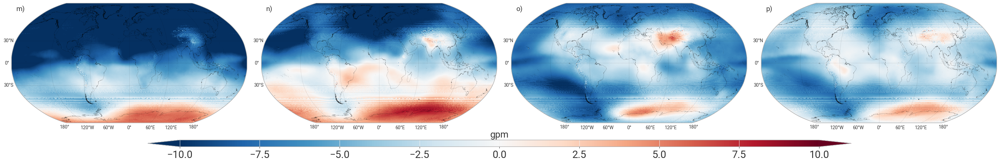 | **Seasonal Z500 bias.** |

---

## 3. Event-based Storylines

### July 2019 Paris Heatwave

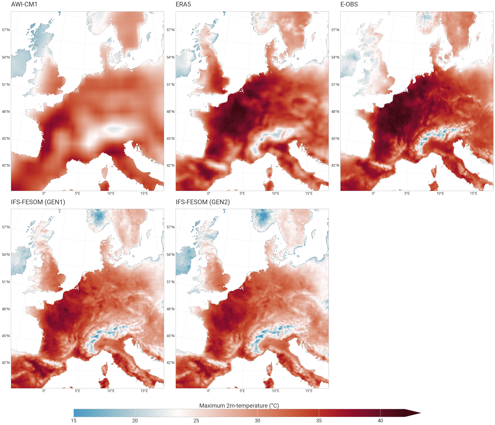

**Caption:** Evaluation of the July 2019 Paris heatwave in G2 across the three climate backgrounds (Cont/Hist/Tp2K).

### September 2024 Storm Boris

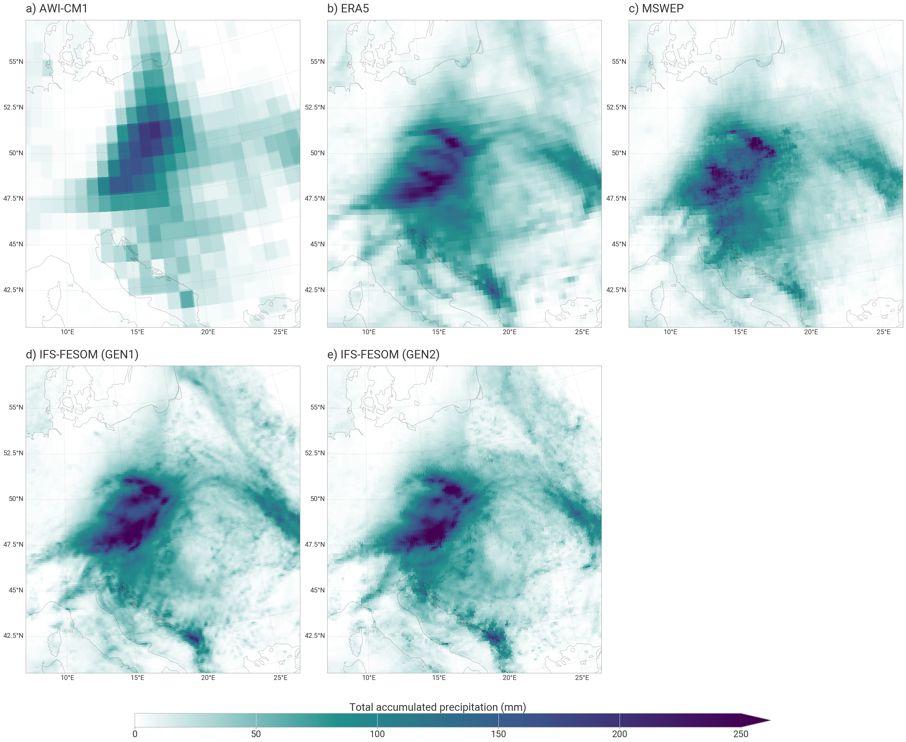

**Caption:** Storm Boris precipitation evaluation in G2. Compare extreme rainfall area (>100 mm) to G1 numbers:
- G1: **+19.4%** expansion of area >100 mm from Cont → Hist
- G1: **+3.5%** additional increase from Hist → Tp2K

#### Signal comparison (fill in G2 values from plots)

| Event | Signal | G1 | G2 | Δ G2−G1 |
|-------|--------|----|----|---------|
| Storm Boris | Area >100 mm: Cont→Hist | +19.4% | TBD | TBD |
| Storm Boris | Area >100 mm: Hist→Tp2K | +3.5% | TBD | TBD |
| Paris HW | Peak T2M anomaly, Hist (°C) | TBD | TBD | TBD |
| Paris HW | Peak T2M change, Hist→Tp2K (°C) | TBD | TBD | TBD |

---

## 4. Ensemble Spread (E1–E5)

> 🎉 **G2 upgrade:** In G1, 5 ensemble members existed only for the last part of 2024. In G2, all five members run the **full period**, enabling robust uncertainty quantification throughout the entire simulation.

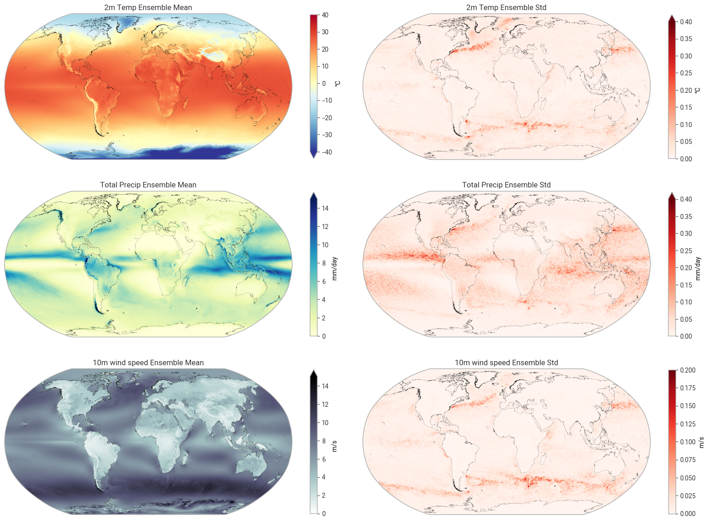

**Caption:** Ensemble mean and standard deviation across E1–E5 (G2). Assess whether the EERIE initialization reduces ensemble spread relative to G1.

---

## 5. Summary Table

| Aspect | G1 | G2 | Assessment |
|--------|----|----|-----------|
| Model version | Original | Bugfixed + new runoff | ✅ Improved |
| Cont IC | ERA5 atm + standalone FESOM (1945–49) | EERIE control (1950) | ✅ Consistent |
| Hist IC | ERA5 atm + standalone FESOM (2012–16) | EERIE historical (2017) | ✅ Consistent |
| Tp2K IC | NextGEMS branch (2040) | EERIE projection (2050) | ✅ Consistent |
| Cross-experiment IC consistency | ❌ Mixed (ERA5 / NextGEMS) | ✅ All EERIE | ✅ Resolved |
| Ocean spinup quality | 5-yr standalone | Long EERIE coupled | ✅ Much better |
| Storm Boris Cont→Hist signal | +19.4% | TBD | TBD |
| Storm Boris Hist→Tp2K signal | +3.5% | TBD | TBD |
| Global mean warming Cont→Hist | +1.3 K | **+0.9 K** | −0.4 K |
| Global mean warming Hist→Tp2K | +1.0 K | **+1.3 K** | +0.3 K |
| Ensemble coverage | 5 members, end-2024 only | 5 members, **full period** | ✅ Upgrade |

---

*IFS-FESOM km-scale storyline simulations · Amal John · G1 vs G2 comparison*
